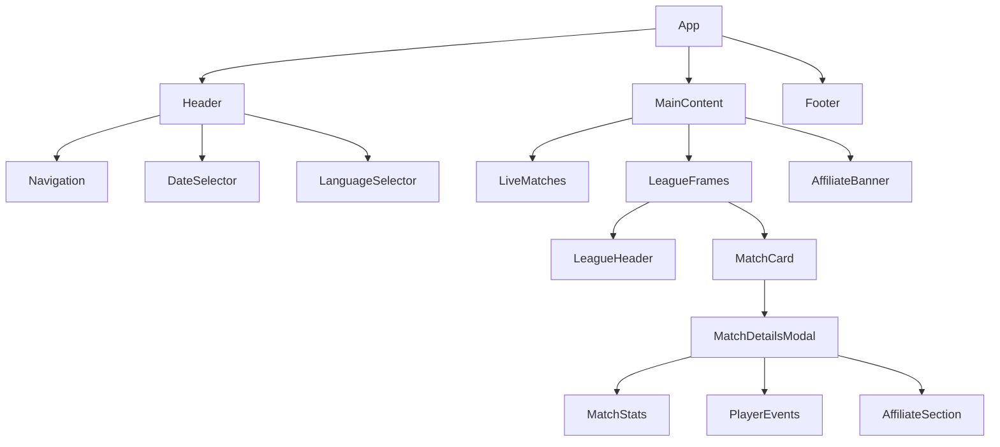

# Live Football Score Website Design

## Overview
A modern, purple-themed live football score website focused exclusively on football matches, similar to Maçkolik, Flashscore, and Sofascore. The platform features real-time match data, comprehensive statistics, and affiliate-focused monetization with an emphasis on user engagement and conversion.

### Target Audience
- Football enthusiasts seeking live scores and statistics
- Betting-interested users (for affiliate conversions)
- Mobile-first users requiring quick access to match information

### Core Value Proposition
- Real-time football scores with comprehensive match details
- Modern, visually appealing interface with purple/cream theme
- Mobile-optimized experience with smooth animations
- Affiliate-focused design for monetization

## Technology Stack & Dependencies

### Frontend Framework
- **React 18+** with TypeScript for type safety
- **Tailwind CSS** for styling and responsive design
- **Vite** as build tool for fast development

### Styling & Theme System
```typescript
// Color palette configuration
const themeColors = {
  primary: {
    purple: '#6B21A8',    // Main purple
    light: '#9333EA',     // Lighter purple
    dark: '#581C87'       // Darker purple
  },
  secondary: {
    cream: '#F5F5DC',     // Main cream
    light: '#FEFCF0',     // Lighter cream
    dark: '#F0E68C'       // Darker cream
  },
  accent: {
    gold: '#FFD700',      // For highlights
    green: '#10B981',     // Success/live indicator
    red: '#EF4444'        // Error/ended matches
  }
}
```

### Key Dependencies
- **Framer Motion** - Advanced animations and transitions
- **React Query** - Data fetching and caching
- **React Router** - Client-side routing
- **Lucide React** - Icon library
- **Date-fns** - Date manipulation

## Component Architecture

### Component Hierarchy


### Core Components

#### Header Component
```typescript
interface HeaderProps {
  currentDate: Date;
  onDateChange: (date: Date) => void;
  activeSection: 'scores' | 'news' | 'analyses' | 'contact';
}

const Header: React.FC<HeaderProps> = ({ currentDate, onDateChange, activeSection }) => (
  <header className="bg-gradient-to-r from-purple-800 to-purple-600 shadow-lg sticky top-0 z-50">
    <div className="container mx-auto px-4">
      <div className="flex items-center justify-between h-16 lg:h-20">
        {/* Logo and Brand */}
        <div className="flex items-center space-x-4">
          <div className="bg-cream-light rounded-lg p-2 shadow-md">
            <Trophy className="h-8 w-8 text-purple-800" />
          </div>
          <h1 className="text-xl lg:text-2xl font-bold text-cream-light">
            FutbolLive
          </h1>
        </div>
        
        {/* Navigation Menu */}
        <nav className="hidden md:flex items-center space-x-8">
          {menuItems.map(item => (
            <button
              key={item.key}
              className={`
                relative px-4 py-2 rounded-lg font-medium transition-all duration-300
                ${activeSection === item.key 
                  ? 'text-cream-light bg-white/10 shadow-md' 
                  : 'text-cream hover:text-cream-light hover:bg-white/5'
                }
                before:absolute before:inset-0 before:rounded-lg 
                before:bg-gradient-to-r before:from-transparent before:via-white/5 before:to-transparent
                before:opacity-0 hover:before:opacity-100 before:transition-opacity
              `}
            >
              {item.label}
            </button>
          ))}
        </nav>
        
        {/* Date Selector */}
        <DateSelector 
          currentDate={currentDate}
          onChange={onDateChange}
          className="bg-cream text-purple-800 hover:bg-cream-dark"
        />
      </div>
    </div>
  </header>
);
```

#### Match Card Component
```typescript
interface MatchCardProps {
  match: Match;
  isLive: boolean;
  onClick: () => void;
}

const MatchCard: React.FC<MatchCardProps> = ({ match, isLive, onClick }) => (
  <div 
    onClick={onClick}
    className={`
      relative p-4 rounded-xl cursor-pointer transition-all duration-300 group
      ${isLive 
        ? 'bg-gradient-to-r from-green-50 to-emerald-50 border-2 border-green-200 shadow-green-100' 
        : 'bg-cream-light border border-purple-100 hover:border-purple-300'
      }
      hover:shadow-xl hover:scale-[1.02] hover:bg-white
      before:absolute before:inset-0 before:rounded-xl before:bg-gradient-to-r 
      before:from-purple-500/0 before:via-purple-500/5 before:to-purple-500/0
      before:opacity-0 group-hover:before:opacity-100 before:transition-opacity
    `}
  >
    {/* Live Indicator */}
    {isLive && (
      <div className="absolute -top-2 -right-2">
        <div className="bg-red-500 text-white text-xs px-2 py-1 rounded-full animate-pulse">
          CANLI
        </div>
      </div>
    )}
    
    {/* Match Content */}
    <div className="flex items-center justify-between">
      {/* Teams */}
      <div className="flex-1 space-y-2">
        <div className="flex items-center justify-between">
          <div className="flex items-center space-x-3">
            
            <span className="font-semibold text-gray-800">{match.homeTeam.name}</span>
          </div>
          <span className="text-2xl font-bold text-purple-800">{match.homeScore}</span>
        </div>
        
        <div className="flex items-center justify-between">
          <div className="flex items-center space-x-3">
            
            <span className="font-semibold text-gray-800">{match.awayTeam.name}</span>
          </div>
          <span className="text-2xl font-bold text-purple-800">{match.awayScore}</span>
        </div>
      </div>
      
      {/* Match Status */}
      <div className="text-center ml-4">
        <div className={`text-sm font-medium ${isLive ? 'text-red-600' : 'text-gray-600'}`}>
          {match.status}
        </div>
        {match.minute && (
          <div className="text-xs text-gray-500">{match.minute}'</div>
        )}
      </div>
    </div>
    
    {/* Glow Effect on Hover */}
    <div className="absolute inset-0 rounded-xl opacity-0 group-hover:opacity-20 bg-gradient-to-r from-purple-400 via-pink-400 to-purple-400 blur-xl transition-opacity" />
  </div>
);
```

#### League Frame Component
```typescript
const LeagueFrame: React.FC<{ league: League }> = ({ league }) => (
  <div className="bg-white rounded-2xl shadow-lg border border-purple-100 overflow-hidden mb-6">
    {/* League Header */}
    <div className="bg-gradient-to-r from-purple-600 to-purple-500 p-4">
      <div className="flex items-center space-x-4">
        
        <div>
          <h3 className="text-xl font-bold text-cream-light">{league.name}</h3>
          <p className="text-purple-100 text-sm">{league.country}</p>
        </div>
        <div className="ml-auto">
          <span className="bg-white/20 text-cream-light px-3 py-1 rounded-full text-sm">
            {league.matches.length} maç
          </span>
        </div>
      </div>
    </div>
    
    {/* Matches */}
    <div className="p-4 space-y-3">
      {league.matches.map(match => (
        <MatchCard 
          key={match.id}
          match={match}
          isLive={match.status === 'live'}
          onClick={() => openMatchDetails(match.id)}
        />
      ))}
    </div>
  </div>
);
```

## Routing & Navigation

### Route Structure
```mermaid
graph TD
    A[/ - Homepage] --> B[Live Matches]
    A --> C[League Sections]
    A --> D[Affiliate Banners]
    
    E[/match/:id] --> F[Match Details]
    F --> G[Statistics Tab]
    F --> H[Events Tab]
    F --> I[Lineups Tab]
    
    J[/news] --> K[News Articles]
    L[/analyses] --> M[Match Analysis]
    N[/contact] --> O[Contact Form]
```

### Navigation Implementation
```typescript
const AppRouter: React.FC = () => (
  <Router>
    <div className="min-h-screen bg-gradient-to-br from-cream-light to-white">
      <Header />
      
      <Routes>
        <Route path="/" element={<HomePage />} />
        <Route path="/match/:id" element={<MatchDetails />} />
        <Route path="/news" element={<NewsPage />} />
        <Route path="/analyses" element={<AnalysesPage />} />
        <Route path="/contact" element={<ContactPage />} />
      </Routes>
      
      <Footer />
    </div>
  </Router>
);
```

## Data Models & Schemas

### Core Data Types
```typescript
interface Match {
  id: string;
  homeTeam: Team;
  awayTeam: Team;
  homeScore: number;
  awayScore: number;
  status: 'scheduled' | 'live' | 'halftime' | 'finished';
  minute?: number;
  league: League;
  date: Date;
  events: MatchEvent[];
  statistics: MatchStatistics;
}

interface Team {
  id: string;
  name: string;
  logo: string;
  country: string;
}

interface League {
  id: string;
  name: string;
  country: string;
  logo: string;
  priority: number; // For popular leagues ordering
}

interface MatchEvent {
  id: string;
  type: 'goal' | 'yellow_card' | 'red_card' | 'substitution';
  minute: number;
  player: string;
  team: 'home' | 'away';
  description: string;
}

interface MatchStatistics {
  possession: { home: number; away: number };
  shots: { home: number; away: number };
  shotsOnTarget: { home: number; away: number };
  corners: { home: number; away: number };
  fouls: { home: number; away: number };
  yellowCards: { home: number; away: number };
  redCards: { home: number; away: number };
}
```

## Business Logic Layer

### Match Data Management
```typescript
class MatchService {
  private apiClient: ApiClient;
  private cache: Map<string, Match> = new Map();

  async getLiveMatches(): Promise<Match[]> {
    const matches = await this.apiClient.get('/matches/live');
    return matches.filter(m => m.status === 'live');
  }

  async getMatchesByDate(date: Date): Promise<Match[]> {
    const cacheKey = `matches_${format(date, 'yyyy-MM-dd')}`;
    
    if (this.cache.has(cacheKey)) {
      return this.cache.get(cacheKey)!;
    }

    const matches = await this.apiClient.get(`/matches/${format(date, 'yyyy-MM-dd')}`);
    this.cache.set(cacheKey, matches);
    return matches;
  }

  async getMatchDetails(matchId: string): Promise<Match> {
    return this.apiClient.get(`/matches/${matchId}`);
  }

  // Real-time updates
  subscribeToLiveUpdates(callback: (match: Match) => void) {
    const ws = new WebSocket('wss://api.futbollive.com/live');
    ws.onmessage = (event) => {
      const match = JSON.parse(event.data);
      callback(match);
    };
    return ws;
  }
}
```

### League Priority System
```typescript
const POPULAR_LEAGUES = [
  { id: 'premier-league', name: 'Premier League', priority: 1 },
  { id: 'la-liga', name: 'La Liga', priority: 2 },
  { id: 'serie-a', name: 'Serie A', priority: 3 },
  { id: 'bundesliga', name: 'Bundesliga', priority: 4 },
  { id: 'ligue-1', name: 'Ligue 1', priority: 5 }
];

const sortLeaguesByPopularity = (leagues: League[]): League[] => {
  return leagues.sort((a, b) => {
    const priorityA = POPULAR_LEAGUES.find(l => l.id === a.id)?.priority || 999;
    const priorityB = POPULAR_LEAGUES.find(l => l.id === b.id)?.priority || 999;
    return priorityA - priorityB;
  });
};
```

## Styling Strategy

### Theme Configuration
```typescript
// tailwind.config.js
module.exports = {
  theme: {
    extend: {
      colors: {
        purple: {
          50: '#F3E8FF',
          600: '#9333EA',
          800: '#6B21A8'
        },
        cream: {
          light: '#FEFCF0',
          DEFAULT: '#F5F5DC',
          dark: '#F0E68C'
        }
      },
      animation: {
        'glow': 'glow 2s ease-in-out infinite alternate',
        'shake': 'shake 0.5s ease-in-out',
        'pulse-slow': 'pulse 3s cubic-bezier(0.4, 0, 0.6, 1) infinite'
      },
      keyframes: {
        glow: {
          'from': { boxShadow: '0 0 20px rgba(107, 33, 168, 0.3)' },
          'to': { boxShadow: '0 0 30px rgba(107, 33, 168, 0.6)' }
        },
        shake: {
          '0%, 100%': { transform: 'translateX(0)' },
          '25%': { transform: 'translateX(-5px)' },
          '75%': { transform: 'translateX(5px)' }
        }
      }
    }
  }
}
```

### Responsive Design Patterns
```css
/* Mobile-first approach */
.match-card {
  @apply p-3 sm:p-4 lg:p-6;
  @apply text-sm sm:text-base lg:text-lg;
  @apply rounded-lg sm:rounded-xl lg:rounded-2xl;
}

.league-frame {
  @apply mb-4 sm:mb-6 lg:mb-8;
  @apply mx-2 sm:mx-4 lg:mx-0;
}

/* Touch-friendly buttons on mobile */
.affiliate-button {
  @apply min-h-[44px] sm:min-h-[40px];
  @apply px-4 sm:px-6 lg:px-8;
}
```

### Animation & Interaction Effects
```typescript
// Framer Motion variants
const cardVariants = {
  hidden: { opacity: 0, y: 20 },
  visible: { 
    opacity: 1, 
    y: 0,
    transition: { duration: 0.3, ease: "easeOut" }
  },
  hover: {
    scale: 1.02,
    boxShadow: "0 10px 25px rgba(107, 33, 168, 0.15)",
    transition: { duration: 0.2 }
  }
};

const affiliateButtonVariants = {
  idle: { scale: 1 },
  hover: { 
    scale: 1.05,
    boxShadow: "0 0 20px rgba(255, 215, 0, 0.5)"
  },
  tap: { scale: 0.95 }
};
```

## Match Details Modal Architecture

### Modal Structure
```typescript
const MatchDetailsModal: React.FC<{ matchId: string; onClose: () => void }> = ({ matchId, onClose }) => (
  <motion.div 
    initial={{ opacity: 0 }}
    animate={{ opacity: 1 }}
    exit={{ opacity: 0 }}
    className="fixed inset-0 bg-black/50 backdrop-blur-sm flex items-center justify-center z-50 p-4"
    onClick={onClose}
  >
    <motion.div 
      initial={{ scale: 0.9, opacity: 0 }}
      animate={{ scale: 1, opacity: 1 }}
      exit={{ scale: 0.9, opacity: 0 }}
      className="bg-white rounded-2xl max-w-4xl w-full max-h-[90vh] overflow-hidden shadow-2xl"
      onClick={e => e.stopPropagation()}
    >
      {/* Header */}
      <div className="bg-gradient-to-r from-purple-600 to-purple-500 p-6">
        <MatchHeader match={match} />
      </div>
      
      {/* Tabs */}
      <div className="border-b border-gray-200">
        <TabNavigation activeTab={activeTab} onChange={setActiveTab} />
      </div>
      
      {/* Content */}
      <div className="p-6 overflow-y-auto max-h-[60vh]">
        {activeTab === 'stats' && <MatchStatistics statistics={match.statistics} />}
        {activeTab === 'events' && <MatchEvents events={match.events} />}
        {activeTab === 'lineups' && <MatchLineups lineups={match.lineups} />}
      </div>
      
      {/* Affiliate Section */}
      <AffiliateSection className="border-t border-gray-100 p-6" />
    </motion.div>
  </motion.div>
);
```

### Statistics Visualization
```typescript
const StatisticBar: React.FC<{ label: string; homeValue: number; awayValue: number }> = ({ 
  label, homeValue, awayValue 
}) => {
  const total = homeValue + awayValue;
  const homePercentage = total > 0 ? (homeValue / total) * 100 : 50;
  
  return (
    <div className="py-3">
      <div className="flex justify-between items-center mb-2">
        <span className="text-sm font-medium text-gray-700">{homeValue}</span>
        <span className="text-xs text-gray-500 font-medium">{label}</span>
        <span className="text-sm font-medium text-gray-700">{awayValue}</span>
      </div>
      
      <div className="relative h-2 bg-gray-200 rounded-full overflow-hidden">
        <motion.div
          initial={{ width: 0 }}
          animate={{ width: `${homePercentage}%` }}
          className="absolute left-0 top-0 h-full bg-gradient-to-r from-purple-500 to-purple-400"
          transition={{ duration: 1, delay: 0.2 }}
        />
        <motion.div
          initial={{ width: 0 }}
          animate={{ width: `${100 - homePercentage}%` }}
          className="absolute right-0 top-0 h-full bg-gradient-to-l from-blue-500 to-blue-400"
          transition={{ duration: 1, delay: 0.2 }}
        />
      </div>
    </div>
  );
};
```

## Affiliate Integration System

### Affiliate Banner Component
```typescript
const AffiliateBanner: React.FC<{ placement: 'header' | 'modal' | 'sidebar' }> = ({ placement }) => {
  const bannerConfig = {
    header: {
      height: 'h-20',
      text: 'En İyi Bahis Oranları',
      cta: 'Hemen Katıl',
      gradient: 'from-gold to-yellow-400'
    },
    modal: {
      height: 'h-24',
      text: 'Bu Maça Bahis Yap',
      cta: 'Bahis Yap',
      gradient: 'from-purple-500 to-pink-500'
    }
  }[placement];
  
  return (
    <motion.div 
      className={`
        ${bannerConfig.height} bg-gradient-to-r ${bannerConfig.gradient} 
        rounded-xl p-4 cursor-pointer group relative overflow-hidden
        shadow-lg hover:shadow-xl transition-all duration-300
      `}
      whileHover={{ scale: 1.02 }}
      whileTap={{ scale: 0.98 }}
      onClick={() => trackAffiliateClick(placement)}
    >
      {/* Animated Background */}
      <div className="absolute inset-0 bg-gradient-to-r from-white/0 via-white/20 to-white/0 
                      transform -skew-x-12 translate-x-[-200%] group-hover:translate-x-[200%] 
                      transition-transform duration-1000" />
      
      {/* Content */}
      <div className="relative z-10 h-full flex items-center justify-between">
        <div>
          <h3 className="text-white font-bold text-lg">{bannerConfig.text}</h3>
          <p className="text-white/80 text-sm">%100 Bonus + Freespin</p>
        </div>
        
        <motion.button 
          className="bg-white text-purple-600 px-6 py-2 rounded-full font-bold
                     hover:bg-cream shadow-md hover:shadow-lg"
          whileHover={{ scale: 1.05, boxShadow: "0 0 20px rgba(255,255,255,0.5)" }}
          whileTap={{ scale: 0.95 }}
        >
          {bannerConfig.cta}
        </motion.button>
      </div>
      
      {/* Sparkle Effects */}
      <div className="absolute top-2 right-4 animate-pulse">
        <Star className="w-4 h-4 text-white/60" />
      </div>
    </motion.div>
  );
};
```

### Conversion Tracking
```typescript
class AffiliateTracker {
  trackClick(placement: string, campaignId: string) {
    // Analytics tracking
    gtag('event', 'affiliate_click', {
      placement,
      campaign_id: campaignId,
      timestamp: Date.now()
    });
    
    // Heat mapping
    hotjar('event', 'affiliate_interaction');
    
    // Custom tracking
    this.sendToAnalytics({
      event: 'affiliate_click',
      placement,
      user_session: this.getSessionId()
    });
  }
  
  trackConversion(affiliateId: string, amount: number) {
    gtag('event', 'purchase', {
      transaction_id: this.generateTransactionId(),
      value: amount,
      currency: 'TRY',
      affiliate_id: affiliateId
    });
  }
}
```

## API Integration Layer

### Real-time Data Fetching
```typescript
class LiveDataService {
  private wsConnection: WebSocket | null = null;
  private reconnectAttempts = 0;
  private maxReconnectAttempts = 5;
  
  constructor(private callbacks: {
    onMatchUpdate: (match: Match) => void;
    onScoreChange: (matchId: string, newScore: Score) => void;
    onMatchEvent: (event: MatchEvent) => void;
  }) {}
  
  connect() {
    this.wsConnection = new WebSocket('wss://api.futbollive.com/live');
    
    this.wsConnection.onmessage = (event) => {
      const data = JSON.parse(event.data);
      
      switch (data.type) {
        case 'match_update':
          this.callbacks.onMatchUpdate(data.match);
          break;
        case 'score_change':
          this.callbacks.onScoreChange(data.matchId, data.score);
          this.triggerGoalAnimation(data.matchId);
          break;
        case 'match_event':
          this.callbacks.onMatchEvent(data.event);
          break;
      }
    };
    
    this.wsConnection.onclose = () => {
      if (this.reconnectAttempts < this.maxReconnectAttempts) {
        setTimeout(() => {
          this.reconnectAttempts++;
          this.connect();
        }, 1000 * this.reconnectAttempts);
      }
    };
  }
  
  private triggerGoalAnimation(matchId: string) {
    const matchCard = document.querySelector(`[data-match-id="${matchId}"]`);
    if (matchCard) {
      matchCard.classList.add('animate-shake');
      setTimeout(() => {
        matchCard.classList.remove('animate-shake');
      }, 500);
    }
  }
}
```

### Caching Strategy
```typescript
class CacheManager {
  private cache = new Map<string, { data: any; timestamp: number; ttl: number }>();
  
  set(key: string, data: any, ttlMinutes: number = 5) {
    this.cache.set(key, {
      data,
      timestamp: Date.now(),
      ttl: ttlMinutes * 60 * 1000
    });
  }
  
  get<T>(key: string): T | null {
    const cached = this.cache.get(key);
    if (!cached) return null;
    
    if (Date.now() - cached.timestamp > cached.ttl) {
      this.cache.delete(key);
      return null;
    }
    
    return cached.data;
  }
  
  // Preload popular leagues data
  async preloadPopularData() {
    const promises = POPULAR_LEAGUES.map(league => 
      this.fetchAndCache(`leagues/${league.id}/matches`, 10) // 10 min cache
    );
    
    await Promise.all(promises);
  }
}
```

## SEO & Performance Optimization

### Meta Tags & Structured Data
```typescript
const SEOHead: React.FC<{ match?: Match }> = ({ match }) => (
  <Helmet>
    <title>
      {match 
        ? `${match.homeTeam.name} vs ${match.awayTeam.name} Canlı Skor | FutbolLive`
        : 'Canlı Futbol Skorları | FutbolLive - En Güncel Maç Sonuçları'
      }
    </title>
    
    <meta name="description" content={
      match
        ? `${match.homeTeam.name} vs ${match.awayTeam.name} maçının canlı skorunu takip edin. Gol dakikaları, kartlar ve maç istatistikleri.`
        : 'En güncel futbol skorları, canlı maç sonuçları ve detaylı istatistikler. Premier League, La Liga, Serie A ve daha fazlası.'
    } />
    
    {/* Open Graph */}
    <meta property="og:title" content="FutbolLive - Canlı Futbol Skorları" />
    <meta property="og:type" content="website" />
    <meta property="og:image" content="/og-image.jpg" />
    
    {/* Structured Data */}
    <script type="application/ld+json">
      {JSON.stringify({
        "@context": "https://schema.org",
        "@type": "SportsEvent",
        "name": match ? `${match.homeTeam.name} vs ${match.awayTeam.name}` : undefined,
        "startDate": match?.date,
        "competitor": match ? [
          { "@type": "SportsTeam", "name": match.homeTeam.name },
          { "@type": "SportsTeam", "name": match.awayTeam.name }
        ] : undefined
      })}
    </script>
  </Helmet>
);
```

### Performance Optimizations
```typescript
// Lazy loading components
const MatchDetailsModal = lazy(() => import('./MatchDetailsModal'));
const NewsPage = lazy(() => import('./NewsPage'));

// Virtual scrolling for large match lists
const VirtualizedMatchList: React.FC<{ matches: Match[] }> = ({ matches }) => {
  const [visibleItems, setVisibleItems] = useState(20);
  
  useEffect(() => {
    const handleScroll = () => {
      if (window.innerHeight + window.scrollY >= document.body.offsetHeight - 1000) {
        setVisibleItems(prev => Math.min(prev + 20, matches.length));
      }
    };
    
    window.addEventListener('scroll', handleScroll);
    return () => window.removeEventListener('scroll', handleScroll);
  }, [matches.length]);
  
  return (
    <div>
      {matches.slice(0, visibleItems).map(match => (
        <MatchCard key={match.id} match={match} />
      ))}
    </div>
  );
};
```

## Testing Strategy

### Component Testing
```typescript
// MatchCard.test.tsx
describe('MatchCard Component', () => {
  const mockMatch: Match = {
    id: '1',
    homeTeam: { id: '1', name: 'Arsenal', logo: '/arsenal.png', country: 'England' },
    awayTeam: { id: '2', name: 'Chelsea', logo: '/chelsea.png', country: 'England' },
    homeScore: 2,
    awayScore: 1,
    status: 'live',
    minute: 67
  };
  
  it('displays live indicator for live matches', () => {
    render(<MatchCard match={mockMatch} isLive={true} onClick={jest.fn()} />);
    
    expect(screen.getByText('CANLI')).toBeInTheDocument();
    expect(screen.getByText('67\'')).toBeInTheDocument();
  });
  
  it('applies hover animations', async () => {
    const { container } = render(
      <MatchCard match={mockMatch} isLive={false} onClick={jest.fn()} />
    );
    
    const card = container.firstChild as HTMLElement;
    
    fireEvent.mouseEnter(card);
    
    await waitFor(() => {
      expect(card).toHaveClass('hover:scale-[1.02]');
    });
  });
  
  it('calls onClick when clicked', () => {
    const handleClick = jest.fn();
    render(<MatchCard match={mockMatch} isLive={false} onClick={handleClick} />);
    
    fireEvent.click(screen.getByRole('button'));
    
    expect(handleClick).toHaveBeenCalledTimes(1);
  });
});
```

### Integration Testing
```typescript
// LiveDataService.test.tsx
describe('LiveDataService Integration', () => {
  let mockWebSocket: jest.Mocked<WebSocket>;
  let service: LiveDataService;
  
  beforeEach(() => {
    mockWebSocket = {
      send: jest.fn(),
      close: jest.fn(),
      onmessage: null,
      onclose: null
    } as any;
    
    (global as any).WebSocket = jest.fn(() => mockWebSocket);
  });
  
  it('handles score updates correctly', () => {
    const onScoreChange = jest.fn();
    service = new LiveDataService({ 
      onMatchUpdate: jest.fn(),
      onScoreChange,
      onMatchEvent: jest.fn()
    });
    
    service.connect();
    
    // Simulate WebSocket message
    const scoreUpdate = {
      type: 'score_change',
      matchId: '123',
      score: { home: 2, away: 1 }
    };
    
    mockWebSocket.onmessage!({ data: JSON.stringify(scoreUpdate) } as MessageEvent);
    
    expect(onScoreChange).toHaveBeenCalledWith('123', { home: 2, away: 1 });
  });
});
```

### E2E Testing
```typescript
// cypress/integration/match-details.spec.ts
describe('Match Details Flow', () => {
  beforeEach(() => {
    cy.visit('/');
    cy.intercept('GET', '/api/matches/live', { fixture: 'live-matches.json' });
  });
  
  it('opens match details modal on card click', () => {
    cy.get('[data-testid="match-card"]').first().click();
    
    cy.get('[data-testid="match-details-modal"]').should('be.visible');
    cy.get('[data-testid="statistics-tab"]').should('be.visible');
  });
  
  it('displays affiliate banners in modal', () => {
    cy.get('[data-testid="match-card"]').first().click();
    
    cy.get('[data-testid="affiliate-banner"]').should('be.visible');
    cy.get('[data-testid="affiliate-banner"]').should('have.class', 'animate-glow');
  });
  
  it('tracks affiliate clicks', () => {
    cy.window().then((win) => {
      cy.stub(win, 'gtag').as('gtag');
    });
    
    cy.get('[data-testid="match-card"]').first().click();
    cy.get('[data-testid="affiliate-banner"]').click();
    
    cy.get('@gtag').should('have.been.calledWith', 'event', 'affiliate_click');
  });
});
```

## Mobile UX Enhancements

### Touch Interactions
```typescript
const TouchOptimizedButton: React.FC<ButtonProps> = ({ children, ...props }) => (
  <motion.button
    className={`
      min-h-[44px] px-6 py-3 rounded-xl font-semibold
      bg-gradient-to-r from-purple-600 to-purple-500
      text-white shadow-lg active:shadow-sm
      transition-all duration-200
    `}
    whileTap={{ scale: 0.95 }}
    whileHover={{ scale: 1.02 }}
    {...props}
  >
    {children}
  </motion.button>
);
```

### Responsive Breakpoints
```typescript
const breakpoints = {
  xs: '320px',   // Small phones
  sm: '640px',   // Large phones
  md: '768px',   // Tablets
  lg: '1024px',  // Small laptops
  xl: '1280px',  // Large laptops
  '2xl': '1536px' // Desktops
};

// Usage in components
const ResponsiveGrid = () => (
  <div className="
    grid grid-cols-1 
    sm:grid-cols-2 
    lg:grid-cols-3 
    xl:grid-cols-4 
    gap-4 sm:gap-6 lg:gap-8
  ">
    {/* Match cards */}
  </div>
);
```

### Mobile Navigation
```typescript
const MobileNav: React.FC = () => {
  const [isOpen, setIsOpen] = useState(false);
  
  return (
    <>
      {/* Mobile menu button */}
      <button 
        className="lg:hidden p-2 rounded-lg text-cream hover:bg-white/10"
        onClick={() => setIsOpen(true)}
      >
        <Menu className="w-6 h-6" />
      </button>
      
      {/* Mobile overlay */}
      <AnimatePresence>
        {isOpen && (
          <motion.div 
            initial={{ opacity: 0 }}
            animate={{ opacity: 1 }}
            exit={{ opacity: 0 }}
            className="fixed inset-0 bg-black/50 z-50 lg:hidden"
            onClick={() => setIsOpen(false)}
          >
            <motion.div
              initial={{ x: '-100%' }}
              animate={{ x: 0 }}
              exit={{ x: '-100%' }}
              className="w-80 h-full bg-white shadow-2xl"
              onClick={e => e.stopPropagation()}
            >
              <MobileNavContent onClose={() => setIsOpen(false)} />
            </motion.div>
          </motion.div>
        )}
      </AnimatePresence>
    </>
  );
};
```